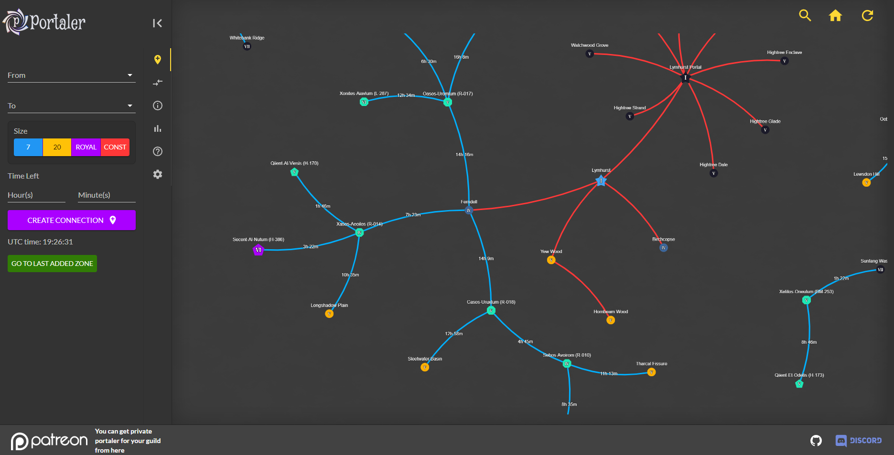

# Portaler is alive!

This repo is Modern Portaler repo of developer from Portaler Community.

Mist Walkers from Portaler Community discord constantly(thx to them) populates public avalon map, to login you need to get Member role in Portaler Community discord server:
https://discord.gg/SRJKjaVPxj

----

# Contents

- [What it is](#what-it-is)
- [Running](#running)
  - [Self-hosting Guide](./docs/selfhosting.md)
  - [Patreon](https://www.patreon.com/portaler/membership)

## What it is

Portaler is a mapping tool for Avalonian Roads in Albion Online, that provides real time private data to your guild or alliance. It is fully Albion TOS compliant, because every user action is completely manual and nothing is automatically pulled or scraped from the Albion client or network packets. This tool simply provides a clean way for guilds/alliances share roads mapping internally.

The data we use to populate information is collected from [Albion Data Project](https://www.albion-online-data.com/).

## Running

There is a full [Self-hosting Guide here](./docs/selfhosting.md)

Or you can get your own instance from our [Patreon](https://www.patreon.com/portaler/membership)
